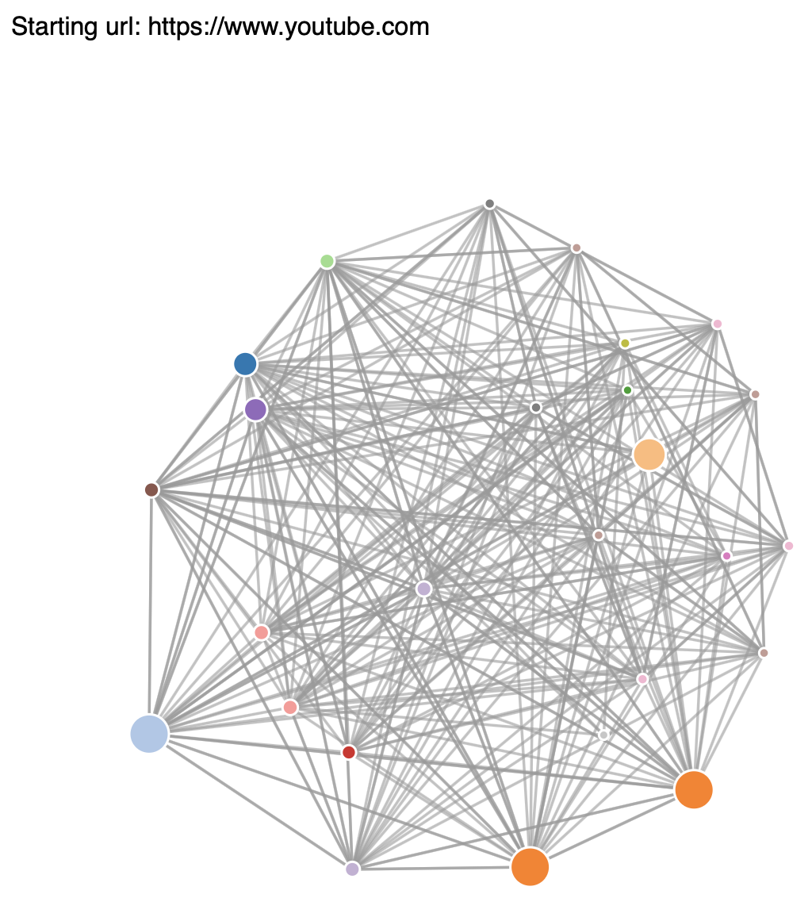

# PageRank
Page rank algorithm is a famous algorithm used by google and is named after Larry Page (Co-founder of google). This algorithm basically helps to visualise links to various website by repeatedly parsing thorugh the links which are available on website. This is what it looks like for 25 iterations in youtube website. How they are interconnected can be visualised here.

